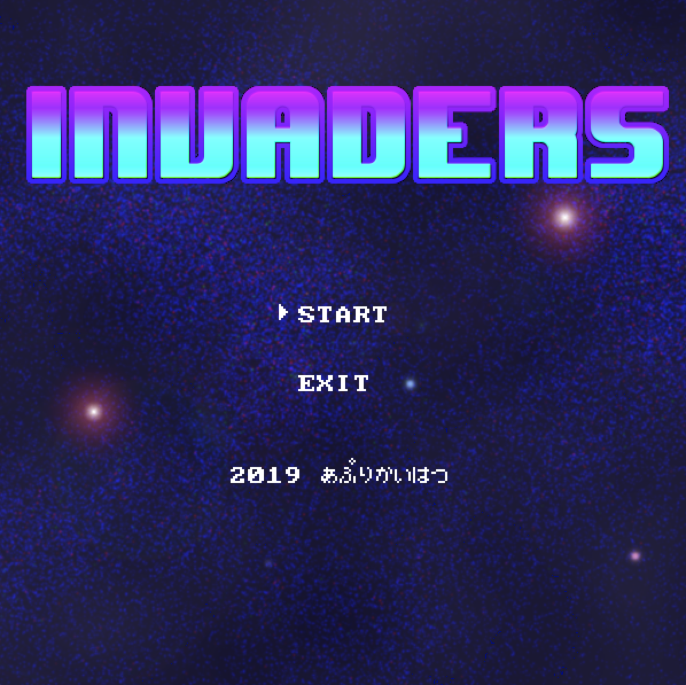
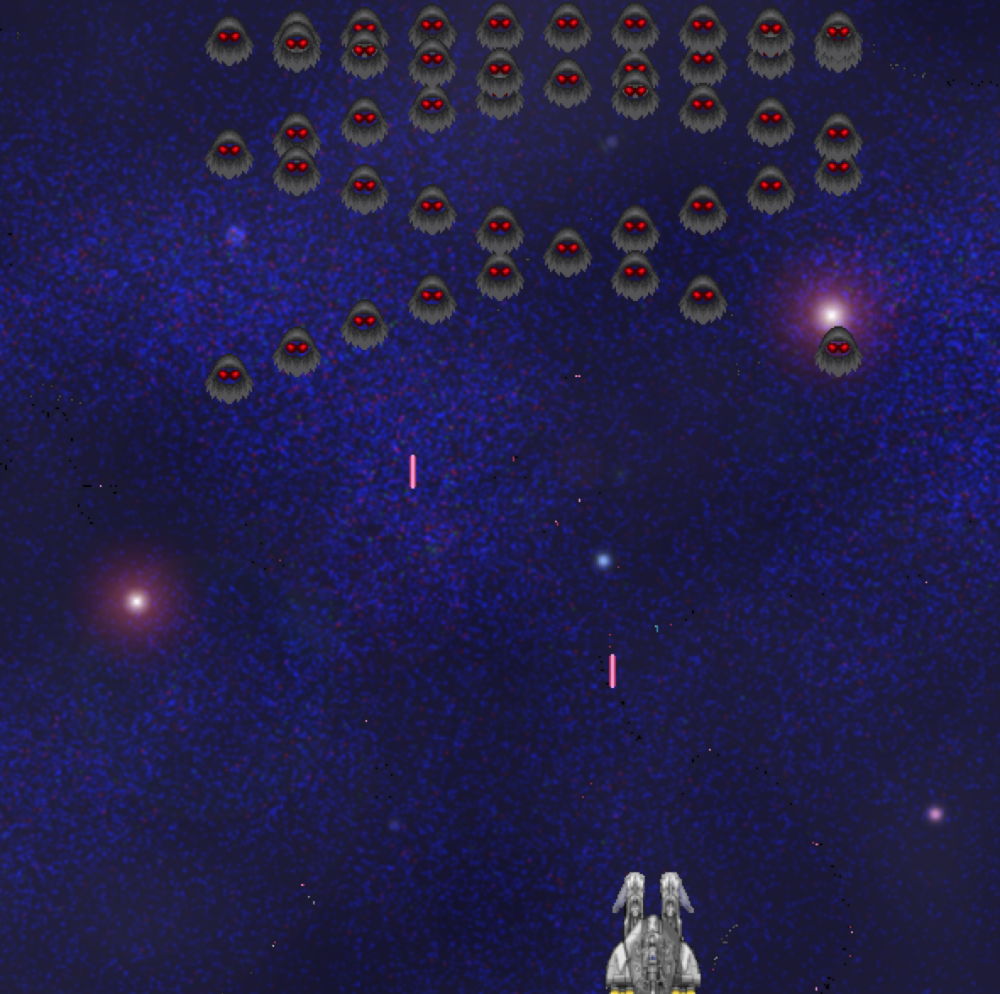

# Invaders

## Overview
This is Invaders for learning Deep-Q-Learning.
You can also enjoy this environment as a video game.

## Demo

## Requirement
This game needs pygame and numpy.
So, before you enjoy this game, you have to install pygame and numpy.
You can install pygame and numpy by following below command.

`pip install requirements.txt`

## Reference
[人工知能に関する断層録 - ゲーム状態の導入](http://aidiary.hatenablog.com/entry/20080727/1281188860)  
[AI+pgame pygameで作るインベーダー風ゲーム](https://blog.formzu.com/pygame-invader-1)

## Author
GitHub account  
[GoneNeko](https://github.com/GoneNeko)

Follow me!!